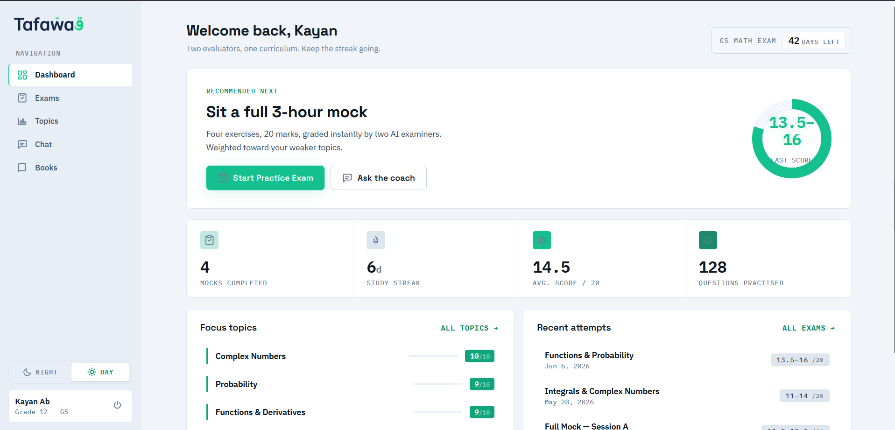
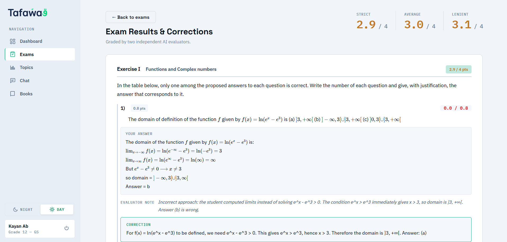
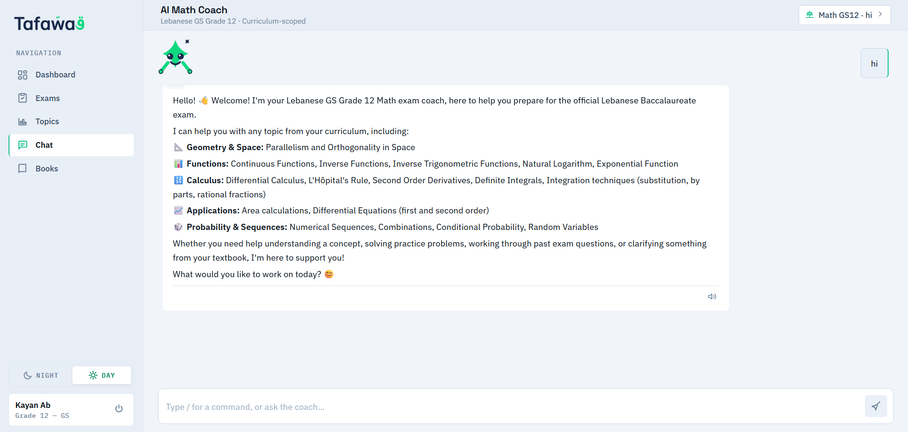
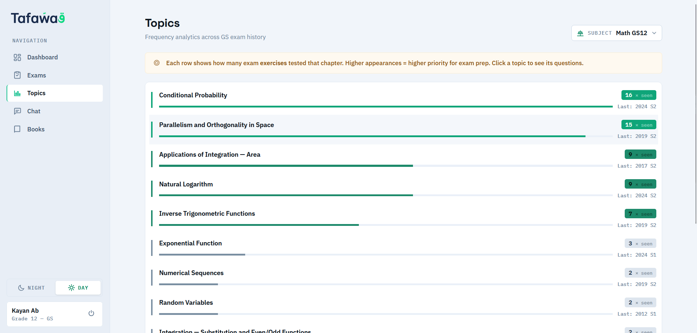
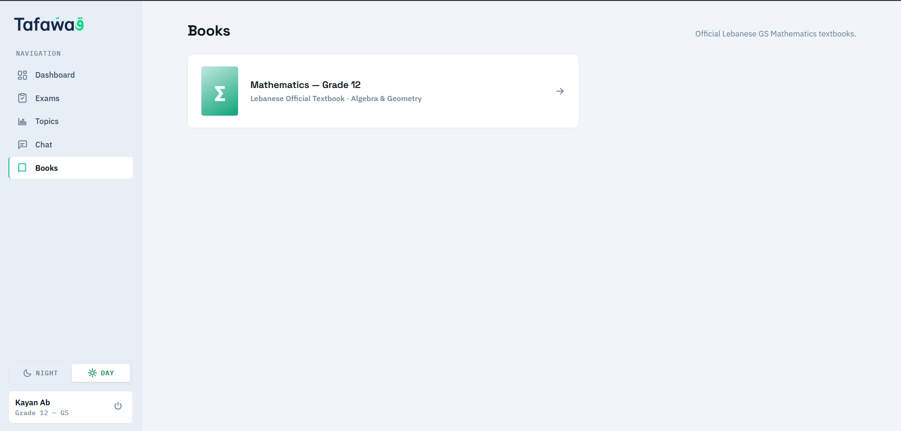
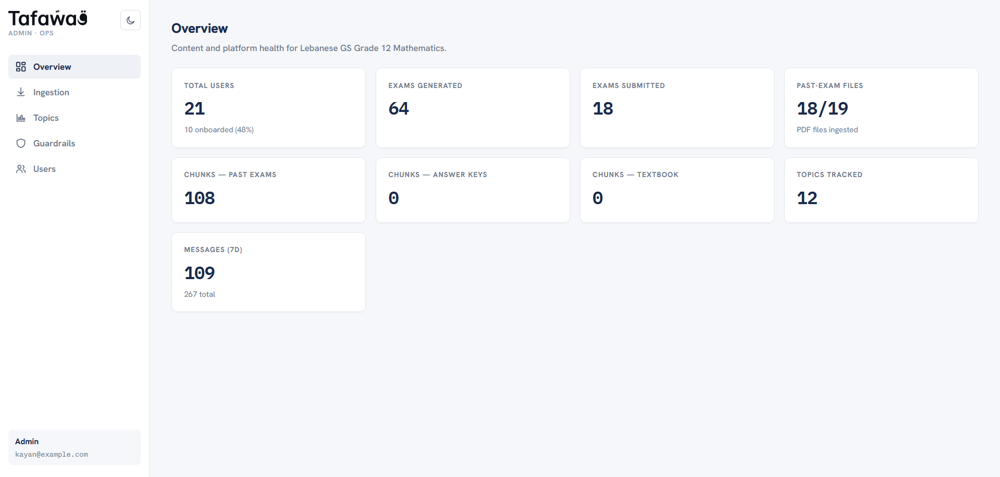
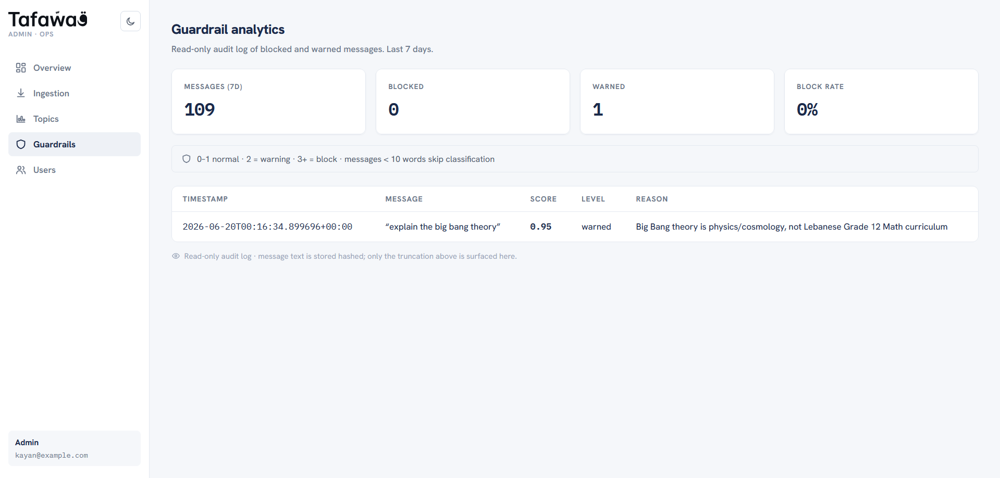

<div align="center">

# 🇱🇧 Tafawwaq — Lebanese Math Coach

### AI-powered exam-prep platform for the Lebanese GS Grade 12 Mathematics Baccalaureate

Generate mock exams, get **dual AI grading**, mine past official exams, study from the textbook, and chat with a curriculum-scoped tutor — all wired to a production-grade FastAPI backend with vector search, guardrails, and full LLM observability.

<br/>


</div>

---

## 📸 Screenshots

> _Replace the placeholders below with real captures from the running app. Drop the images into [`docs/screenshots/`](docs/screenshots/) and keep the filenames, or update the paths._

| Dashboard | Mock Exam |
|---|---|
|  |  |

| Dual AI Grading / Results | Curriculum Tutor Chat |
|---|---|
|  |  |

| Topics Analytics | Textbook Reader |
|---|---|
|  |  |

| Admin — Overview | Admin — Guardrails Audit |
|---|---|
|  |  |

> 🎬 **Add a demo GIF here** — a 10–20s walkthrough (generate → take → grade) lands best at the top of the README:
>
> 

---

## 📑 Table of Contents

- [🇱🇧 Tafawwaq — Lebanese Math Coach](#-tafawwaq--lebanese-math-coach)
    - [AI-powered exam-prep platform for the Lebanese GS Grade 12 Mathematics Baccalaureate](#ai-powered-exam-prep-platform-for-the-lebanese-gs-grade-12-mathematics-baccalaureate)
  - [📸 Screenshots](#-screenshots)
  - [📑 Table of Contents](#-table-of-contents)
  - [✨ Features](#-features)
  - [🏗 Architecture](#-architecture)
  - [🧰 Tech Stack](#-tech-stack)
  - [✅ Prerequisites](#-prerequisites)
  - [🚀 Quick Start (Docker)](#-quick-start-docker)
  - [🌐 Service URLs](#-service-urls)
  - [⚙️ Configuration](#️-configuration)
  - [💻 Local Development (without Docker)](#-local-development-without-docker)
  - [📥 Data Ingestion](#-data-ingestion)
  - [🧑‍🎓 How to Use the App](#-how-to-use-the-app)
  - [🔌 API Overview](#-api-overview)
  - [📁 Project Structure](#-project-structure)
  - [🧪 Testing](#-testing)
  - [🔭 Observability \& Prompt Management](#-observability--prompt-management)
  - [🛡️ Guardrails](#️-guardrails)
  - [🩹 Troubleshooting](#-troubleshooting)

---

## ✨ Features

- **🧪 Mock exam generation** — Claude generates full Lebanese-baccalaureate-style exams on demand, validated by a judge model before they reach the student.
- **⚖️ Dual AI grading** — every submission is scored by two independent evaluator personas; score discrepancies are flagged for review so a single model's blind spot never silently costs a grade.
- **📝 Handwritten answer extraction** — students can upload images/PDFs of their handwritten work; Claude vision extracts the answers before grading.
- **📚 Official past exams** — browse, take, and view PDFs of real past official exams, ingested into Postgres + MinIO.
- **🔎 Curriculum-scoped tutor chat** — streaming SSE chat tutor with textbook page retrieval, math (KaTeX) rendering, and text-to-speech.
- **📖 Textbook reader** — paginated PDF reader with thumbnail navigation and zoom.
- **📊 Topic analytics** — zero-LLM frequency analytics showing which topics appear most across past exams.
- **🛡️ Guardrails** — NeMo-Guardrails sidecar screens chat input (off-topic / prompt-injection / harmful) and generated output, with a PII-redacted audit log.
- **🛠️ Admin console** — separate app for overview metrics, guardrail audits, user management, topic stats, and triggering ingestion.
- **🔭 Full observability** — every LLM call is traced in self-hosted Langfuse, with centralized prompt management.

---

## 🏗 Architecture

```
                         ┌──────────────┐      ┌──────────────┐
                         │  Frontend    │      │  Admin app   │
                         │ React + Vite │      │ React + Vite │
                         └──────┬───────┘      └──────┬───────┘
                                │  HTTP / SSE         │
                                └──────────┬──────────┘
                                           ▼
                                  ┌───────────────────┐
                                  │   FastAPI (api)    │
                                  │  routers→services  │
                                  │   →repositories    │
                                  └───┬───┬───┬───┬────┘
            ┌─────────────┬───────────┘   │   │   └──────────────┐
            ▼             ▼               ▼   ▼                  ▼
     ┌────────────┐ ┌──────────┐  ┌──────────────┐      ┌───────────────┐
     │ PostgreSQL │ │  Redis   │  │ Guardrails   │      │ Vault (KVv2)  │
     │ + pgvector │ │  cache   │  │ NeMo sidecar │      │   secrets     │
     └────────────┘ └──────────┘  └──────────────┘      └───────────────┘
            │                                                   
            │        ┌──────────┐  ┌──────────────┐  ┌──────────────────┐
            └───────▶│  MinIO   │  │   Langfuse   │  │ Claude / Voyage  │
                     │ objects  │  │ observability│  │  ElevenLabs APIs │
                     └──────────┘  └──────────────┘  └──────────────────┘
```

**Backend layering is strict** (see [`CLAUDE.md`](CLAUDE.md) for the full contract):

| Layer | Directory | Responsibility |
|---|---|---|
| API | `app/api/` | HTTP boundary only — routers, request/response shapes. All domain→HTTP error mapping lives in `api/exceptions.py`. |
| Services | `app/services/` | Business logic, transaction owners, streaming generators. |
| Repositories | `app/repositories/` | SQL only. `orm.py` is the single source of ORM models — they never leave this layer. |
| Domain | `app/domain/` | Pydantic models, exception hierarchy, enums that cross layers. |
| Infra | `app/infra/` | Vault, auth, Redis, MinIO, Langfuse, LLM + embedding clients. |

---

## 🧰 Tech Stack

| Layer | Technology |
|---|---|
| **Backend** | Python 3.12, FastAPI 0.115, [uv](https://docs.astral.sh/uv/) |
| **ORM** | SQLAlchemy 2.0 async (asyncpg — SQLite unsupported) |
| **Database** | PostgreSQL 16 + `pgvector` extension |
| **Vector search** | asyncpg raw SQL with the `<=>` cosine operator |
| **Migrations** | Alembic (run by the `migrate` container before the API boots) |
| **Auth** | fastapi-users 13 + JWT |
| **Secrets** | HashiCorp Vault (KV v2) — the app refuses to boot if Vault is unreachable |
| **Cache** | Redis 7 |
| **Object storage** | MinIO (exam/textbook PDFs) |
| **LLM — generation / grading / chat** | `claude-sonnet-4-5` |
| **LLM — ingestion tagging** | `claude-haiku-4-5` |
| **Embeddings** | `voyage-large-2` (1536-d) |
| **Text-to-speech** | ElevenLabs |
| **Transactional email** | Resend (password reset) |
| **Guardrails** | NeMo Guardrails sidecar (`guardrails-service/`) |
| **Observability** | Langfuse v2 (self-hosted) |
| **Frontend / Admin** | React 19 + Vite + TypeScript, KaTeX/MathLive for math |
| **Orchestration** | Docker Compose |

---

## ✅ Prerequisites

- **Docker** & **Docker Compose** (the only hard requirement for the full stack)
- An **Anthropic API key** and a **Voyage AI API key** (the platform calls real LLMs)
- _Optional, only for local non-Docker dev:_ Python 3.12 + [uv](https://docs.astral.sh/uv/), Node.js 20+

> 💡 Dev defaults are baked in for every other secret (DB password, JWT secret, Langfuse keys, etc.), so the stack boots out of the box once the two API keys are set. **Override every dev default before deploying outside local development.**

---

## 🚀 Quick Start (Docker)

```bash
# 1. Clone
git clone <your-repo-url> lebanese-exam-coach
cd lebanese-exam-coach

# 2. Create your .env from the template
cp .env.example .env
#    then edit .env and set your real keys:
#      ANTHROPIC_API_KEY=ant-sk-...
#      VOYAGE_API_KEY=pa-...

# 3. Bring up the whole stack
docker compose up --build
```

On startup Compose runs services in dependency order:

1. `db`, `redis`, `minio`, `vault` come up and pass health checks
2. `vault-seed` writes all secrets into Vault (idempotent)
3. `migrate` runs `alembic upgrade head`
4. `langfuse` self-provisions an org/project/API-key pair (no UI setup needed)
5. `guardrails` (NeMo sidecar) becomes healthy
6. `api` boots (fails fast if Vault is unreachable)
7. `frontend` and `admin` serve the static apps

To run migrations standalone:

```bash
docker compose run --rm migrate
```

---

## 🌐 Service URLs

Once `docker compose up` finishes, these are exposed on the host:

| Service | URL | Notes |
|---|---|---|
| **Student app** | http://localhost:3000 | Main React frontend |
| **Admin console** | http://localhost:5174 | Metrics, guardrail audit, users, ingestion |
| **API** | http://localhost:8000 | FastAPI |
| **API docs** | http://localhost:8000/docs | Swagger UI |
| **Langfuse** | http://localhost:3001 | LLM traces + prompt management |
| **MinIO console** | http://localhost:9001 | `minioadmin` / `minioadmin` (dev) |
| **pgAdmin** | http://localhost:5050 | `admin@local.dev` / `admin` (dev) |
| **Vault** | http://localhost:8200 | Dev token: `dev-root-token` |
| **Guardrails sidecar** | http://localhost:8100 | Internal use |

---

## ⚙️ Configuration

The **only** secrets stored outside Vault (in dev) live in `.env`:

```dotenv
# Vault connection
VAULT_ADDR=http://localhost:8200
VAULT_TOKEN=dev-root-token

# API keys — read once by vault-seed, then sourced from Vault by the app
VOYAGE_API_KEY=pa-xxx
ANTHROPIC_API_KEY=ant-sk-xxx
```

At runtime, **Vault is the single source of secrets**. `vault-seed` populates `secret/lebanese-math-coach` with everything the app needs:

| Secret | Dev default | Override for prod? |
|---|---|---|
| `anthropic_api_key` | — | ✅ required |
| `voyage_api_key` | — | ✅ required |
| `db_url` / `db_password` | `devpassword` | ✅ |
| `minio_access_key` / `minio_secret_key` | `minioadmin` | ✅ |
| `jwt_secret` | `dev-jwt-secret-change-in-prod` | ✅ |
| `elevenlabs_api_key` | placeholder | optional (TTS) |
| `resend_api_key` | empty | optional (password-reset email) |
| `reset_password_token_secret` | dev default | ✅ |
| `langfuse_public_key` / `langfuse_secret_key` | dev pair matching the Langfuse init | ✅ |

> The full list of overridable env vars (and their prod-change warnings) is in [`docker-compose.yml`](docker-compose.yml) and [`scripts/seed_vault.sh`](scripts/seed_vault.sh).

---

## 💻 Local Development (without Docker)

You can run the supporting services in Docker and the app code on your host for faster iteration.

**Backend**

```bash
# Bring up just the infra dependencies
docker compose up -d db redis minio vault vault-seed guardrails langfuse langfuse-db

# Install deps and run migrations + API
uv sync --extra dev
uv run alembic upgrade head
uv run uvicorn app.main:app --reload --port 8000
```

> `VAULT_ADDR` in `.env` must point to `http://localhost:8200` for host-side dev.

**Frontend**

```bash
cd frontend
npm install
npm run dev        # Vite dev server
```

**Admin**

```bash
cd admin
npm install
npm run dev
```

---

## 📥 Data Ingestion

Two offline pipelines populate the platform's content. They can be run from the CLI or triggered from the **Admin → Ingestion** page.

**Textbook** — parses markdown pages (YAML frontmatter, separated by `===PAGE_BREAK===`) into the `textbook_pages` table. Idempotent on re-run; no chunking/embedding (retrieval is page-number lookup).

```bash
uv run python -m ingestion.textbook_pipeline --textbook-dir textbook/
```

Required frontmatter per page: `page` (int), `chapter`, `section`, `type`
(`theory | exercise | self_evaluation | mixed | blank | preface | just_for_fun`).

**Official exams** — PDF → Claude extraction → PostgreSQL `chunks` (embedded with Voyage) + MinIO object storage.

```bash
uv run python -m ingestion.official_exam_pipeline
```

---

## 🧑‍🎓 How to Use the App

1. **Sign up / onboard** — create an account at http://localhost:3000 and complete onboarding.
2. **Dashboard** — see your progress and jump into any activity.
3. **Generate a mock exam** — go to **Exams**, describe what you want, and Claude builds a validated baccalaureate-style exam.
4. **Take it & submit** — answer in the app, or upload a photo/PDF of handwritten work for vision extraction.
5. **Get dual-graded** — two evaluator personas score independently; discrepancies are flagged in **Results**.
6. **Practice past exams** — browse and take real **official past exams**, with the original PDFs viewable.
7. **Study topics** — the **Topics** page ranks how often each topic appears across past exams.
8. **Read the textbook** — the **Books** reader gives paginated PDF access with thumbnails and zoom.
9. **Ask the tutor** — the **Chat** tutor answers curriculum-scoped questions, retrieves textbook pages, renders math, and can read answers aloud (TTS).

**Admins** use the separate console at http://localhost:5174 for platform metrics, the guardrails audit log, user management, topic stats, and triggering ingestion.

---

## 🔌 API Overview

Interactive docs: **http://localhost:8000/docs**. Key route groups:

| Group | Prefix | Highlights |
|---|---|---|
| Auth | `/auth`, `/auth/jwt` | register, login (JWT), password reset, change password |
| Profile | `/auth/me` | `GET/PUT /details` |
| Exams | `/exams` | `POST /generate`, `GET /active`, `POST /{id}/extract-answers`, `GET /{id}` |
| Grading | `/grade`, `/exams/...` | `POST /grade`, `GET /exams/history`, `GET /exams/{id}/results` |
| Official exams | `/official-exams` | list, `POST /{id}/take`, `GET /{id}/pdf` |
| Questions | `/questions` | `POST /retrieve` (vector search) |
| Topics | `/topics` | `GET /stats`, `GET /{topic}/questions` |
| Textbook | `/textbook` | `GET /pages`, `GET /page/{n}`, `GET /pdf/{file}` |
| Chat | `/chat` | sessions CRUD, `POST /chat` (SSE), history, clear |
| TTS | `/tts` | `POST` → audio |
| Admin | `/admin` | overview, guardrails summary/messages, users, ingestion triggers |
| Health | `/health` | liveness/readiness |

> ⚠️ Router registration order matters: **grading is registered before exams** so `GET /exams/history` isn't shadowed by `GET /exams/{session_id}`.

**Chat SSE event types:** `conversation_id`, `token`, `textbook_page`, `guardrail_warning`, `guardrail_block`, `done` / `[DONE]`.

---

## 📁 Project Structure

```
lebanese-exam-coach/
├── app/                  FastAPI backend (api → services → repositories → domain/infra)
├── prompts/              Prompt tiers: shared/ (subject-agnostic) + math/ (Lebanese GS)
├── ingestion/            Offline CLIs: textbook + official-exam pipelines
├── guardrails-service/   NeMo Guardrails sidecar (separate Python project)
├── alembic/              Migrations (0001 baseline, 0002 textbook)
├── scripts/              seed_vault.sh, seed_langfuse_prompts.py
├── frontend/             Student app (React + Vite + TS)
├── admin/                Admin console (React + Vite + TS)
├── textbook/             Markdown textbook source for ingestion
├── specs/                Feature specs & contracts (reference)
├── docker-compose.yml    Full local stack
├── pyproject.toml        Backend deps (uv)
└── CLAUDE.md             Engineering contract — read before changing layers
```

---

## 🧪 Testing

```bash
# Backend test suite (root pytest config; collects tests/ only)
uv run pytest

# Guardrails sidecar has its own suite
cd guardrails-service && python -m pytest tests/test_verdict.py

# Frontend / admin lint
cd frontend && npm run lint
cd admin && npm run lint
```

---

## 🔭 Observability & Prompt Management

- **Langfuse** (http://localhost:3001) traces every Claude call (`stream_claude`, `call_claude`, `call_claude_vision`) with input/output/model/usage.
- **Prompt management** is centralized:
  - *Static prompts* are fetched live from Langfuse at runtime, with the Python constant as a fallback.
  - *Dynamic `build_*()` builders* stay in Python (f-strings + JSON schemas collide with mustache syntax); rendered snapshots are pushed to Langfuse for visibility only.
- **After adding or editing any prompt constant**, re-seed:

```bash
uv run python scripts/seed_langfuse_prompts.py
```

---

## 🛡️ Guardrails

Driven by one classifier call per message against the NeMo sidecar:

- **`off_topic`** — lenient, 3-strike counter in Redis (`guardrails:{conversation_id}`, 3h TTL): 0–1 normal, 2 = warning suffix, 3+ = block.
- **`prompt_injection` / `harmful_content`** — zero-tolerance, block the message immediately.

Generated content (chat replies, exam exercises) is screened with a simpler "safe to show a student?" check. Exam generation **blocks** on a flag (not streamed); chat output is **audited** in the background (already streamed). Every blocked/warned event is persisted to `guardrail_events` with a **PII-redacted** preview (Presidio, scoped to the audit log only — never applied to live chat content) — this backs the Admin → Guardrails page.

---

## 🩹 Troubleshooting

| Symptom | Likely cause / fix |
|---|---|
| API exits at startup with `Vault unavailable` | Vault not healthy yet, or `VAULT_ADDR` wrong. The app **fails fast by design**. Check `docker compose ps` and `VAULT_ADDR`. |
| LLM calls fail / placeholder key errors | `ANTHROPIC_API_KEY` / `VOYAGE_API_KEY` not set in `.env` before `vault-seed` ran. Set them, then `docker compose run --rm vault-seed`. |
| `GET /exams/history` returns the wrong shape | Router order — grading must register before exams (already handled in `main.py`). |
| Langfuse healthcheck never passes | First boot needs `start_period`; give it ~30s. Don't bump past `langfuse/langfuse:2` (v3 needs ClickHouse/S3). |
| Migrations didn't run | `docker compose run --rm migrate`. |
| Changed a prompt but the app shows the old one | Re-run `scripts/seed_langfuse_prompts.py`. |
| pgvector errors on vector queries | The vector type must be registered per asyncpg connection (`register_vector(conn)`); SQLite is unsupported. |

---

<div align="center">

Built for Lebanese GS Grade 12 students. See [`CLAUDE.md`](CLAUDE.md) for the full engineering contract.

</div>
